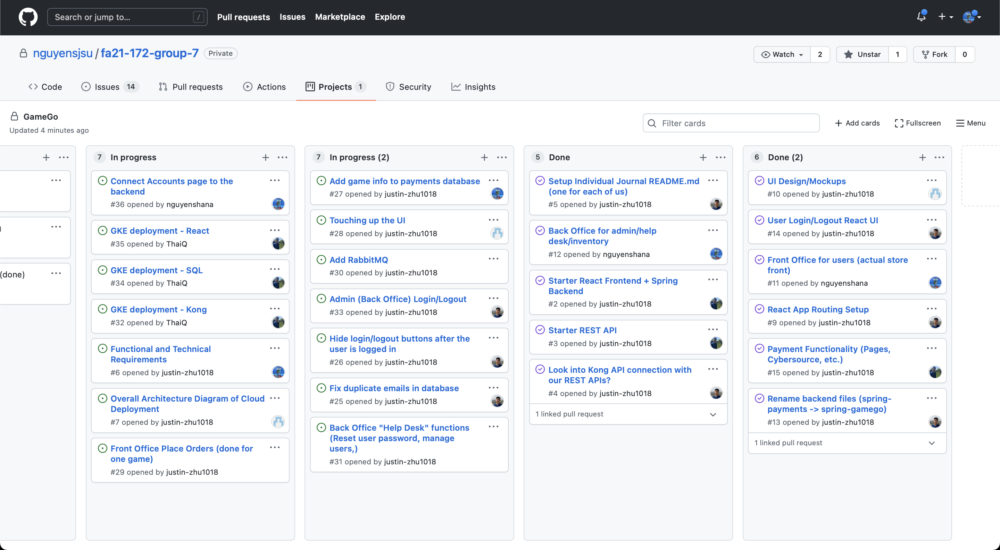

# Individual Journal

Each week should include:
1. A snapshot (point-in-time) image of the Team's Task Board highlighting which "Card" you worked on
2. A discussion of your accomplishments that week with a list of links to your Code Commits and PRs.
3. A discussion of the challenges you faced that week and how your resolved those issues.

## Week 1 (Nov 12 - Nov 17)

### Accomplishments:
- [Functional & Technical Requirements PR](URL "https://github.com/nguyensjsu/fa21-172-group-7/pull/8")
    - The functional requirements will continue to be added to as the project is built

### Challenges:
- A minor challenge was setting up a new branch and creating a PR; I addressed this by googling commands

## Week 2 (Nov 18 - Nov 23)

### Accomplishments:
1. [Front Office for users (actual store front)](URL "https://github.com/nguyensjsu/fa21-172-group-7/issues/11")
- Set up game browsing view and enabled adding to cart
- Used localstorage to hold cart information

2. [Back Office for admin/help desk/inventory](https://github.com/nguyensjsu/fa21-172-group-7/issues/12)
- Inventory
	- Can view a list of games from the database and their information in table format
- Transactions
	- Can view a list of payments from the database and their details in table format
- Accounts
	- Set up table formatting with temporary placeholder data

- [Set up Games, Inventory, Transactions, and Accounts PR](https://github.com/nguyensjsu/fa21-172-group-7/pull/23) addresses #1 and 2 mentioned above

### Challenges:
- Had difficulty figuring out how to set up the API methods and using Kong and Docker; I looked at previous assignments and looked up Lombok annotation meanings
- Had to learn how to use async functions; I looked up tutorials and examples online to learn more about how they work
- Had to read up on Material UI docs in order to use their tables
- Had to learn how to use localstorage through online forums as well as their documentation

## Week 3 (Nov 24 - Nov 30)

### Accomplishments:
1.[Add game info to payments database](https://github.com/nguyensjsu/fa21-172-group-7/issues/27)
- Game information is included when a payment is made, and the game inventory count is decreased
2.[Connect Accounts page to the backend](https://github.com/nguyensjsu/fa21-172-group-7/issues/36)
- Admins can view the accounts page to see all user accounts
3. Added an admin account to view admin-only pages

### Challenges:
- gradle build started failing every time; workaround is to comment out the tests
- admin logout didn't work properly; turns out, the error was that the boolean formatting of `if user == (type1 || type2)` doesn't work, and it needs to be written as `if user == type1 || user == type2`

## Week 4 (Dec 1 - Dec 6)

### Accomplishments:

### Challenges:

