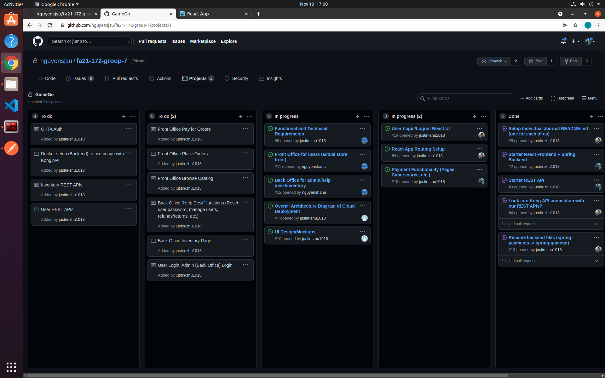
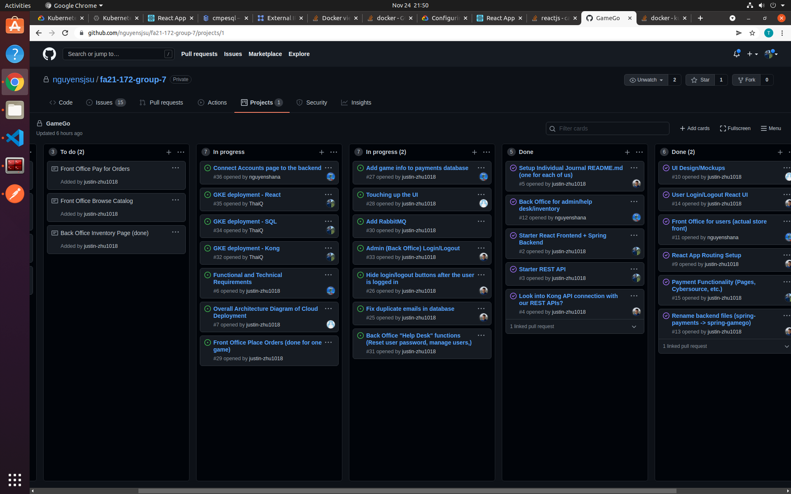
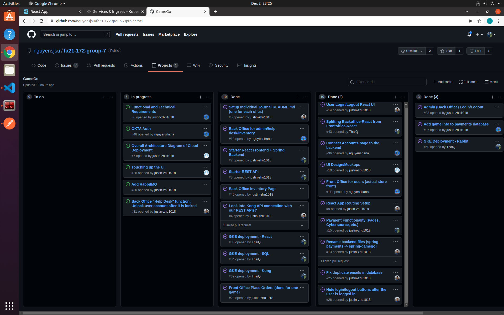

# Individual Journal

## Week 1 (Nov 12 - Nov 17)
1. Snapshot

2. Accomplishments
    * Tasks  
      * Commit starter code for backend and frontend. Frontend - ReactJS template is created from scratch. Backend - SpringMVC is a clone of a working lab 7.
      * Setup an initial/sample GET and POST requests from frontend to backend as sample REST-API.
    * Commits
      * <a href="https://github.com/nguyensjsu/fa21-172-group-7/commit/415af7a51e3a927a397a63721dea6d479f3ea8e8">Backend with REST API</a>
      * <a href="https://github.com/nguyensjsu/fa21-172-group-7/commit/870a75af5ef05081a136da123c4c5331464c7287">Frontend with REST API</a>
3. Challenges
    * First-time setup axios-API calls from ReactJS to SpringMVC
    * No major road-blocks

## Week 2 (Nov 18 - Nov 24)
1. Snapshot

2. Accomplishments
    * Tasks  
      * Creating a webpage for payment with MaterialUI
      * Writing payment REST-API in spring backend with h2 database
      * Integrate payment page with backend API calls
      * Migrate development variables into a `proxy_env.js` file for better controls
    * Commits
      * <a href="https://github.com/nguyensjsu/fa21-172-group-7/pull/19/commits/d2e579b9278f9fb12e5a0453a816ce8d42334ac1">Frontend and Backend of payment system</a>
      * <a href="https://github.com/nguyensjsu/fa21-172-group-7/commit/a814aaf41e6b37f245b630ed74aa3f37cd12bc16">Adding error msg for invalid card</a>
3. Challenges
    * No challenges, just need to have better frontend designs in future PR

## Week 3 (Nov 25 - Dec 1)
1. Snapshot

2. Accomplishments
    * Tasks  
      * Merge and resolves conflicts from other branches into main
      * Setup and deploy on GKE
      * Setup GCP Cloud SQL and connect with backend app
      * Deploy Spring-API backend to GKE
      * Deploy ReactJS Frontend to GKE
    * Commits
      * [Merge and resolves conflicts from other branches](https://github.com/nguyensjsu/fa21-172-group-7/commit/80952ea6a2ebbf3da378d068911690f18400281f)
      * [Docker and GKE files for Backend-API and Kong intergration](https://github.com/nguyensjsu/fa21-172-group-7/commit/9506e5c3ec8b0f3d3dc406f4f1c923e7b013a89a)
      * [Docker and GKE files for ReactJS frontend](https://github.com/nguyensjsu/fa21-172-group-7/commit/e0d60a763b2de1c248fade71b5c63bee41fbb615)
      * [Resolves CORS issues with React Proxy](https://github.com/nguyensjsu/fa21-172-group-7/commit/a25a427fc59ccb7b4800cbc49df7a290d0c41bfb)
3. Challenges
    * During deployment of GKE, React-cluster and Spring-Kong-cluster ran into CORS rejections
    * I asked for help in class Slack, professor Paul Nguyen sent some resoucres and I was able to resolve the cors issue
    * Solution: Proxy React's origin (in `package.json`) to Backend-Cluster IP

## Week 4 (Dec 2 - Dec 6)
1. Snapshot

2. Accomplishments
    * Tasks  
      * Merge and resolves conflicts from other branches into main
      * Splitting Frontend-App into FrontendOfficer and BackendOffice React apps
      * Deploy individuals offices to GKE
      * Deploy RabbitMQ to GKE
    * Commits
      * [Resolves conflicts and merge other branches](https://github.com/nguyensjsu/fa21-172-group-7/commit/2a5a89d24988e07e107fe3a834cc82387f2a78d9)
      * [Splitting into FrontendOfficer and BackendOffice React apps](https://github.com/nguyensjsu/fa21-172-group-7/commit/67bb15371c8d3ef74711fd23d0bd1475197b91ca)
3. Challenges
    * No Significant challenges. GKE deployed no issues.