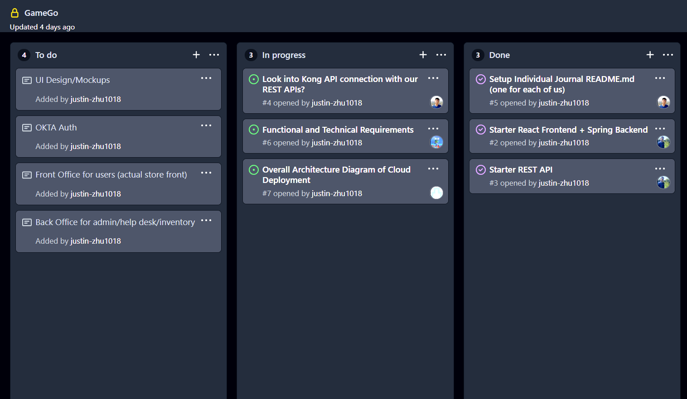

# Individual Journal

## Week 1 (Nov 12 - Nov 17)
1. Snapshot

2. Accomplishments
    * Tasks  
      * Commit starter code for backend and frontend. Frontend - ReactJS template is created from scratch. Backend - SpringMVC is a clone of a working lab 7.
      * Setup an initial/sample GET and POST requests from frontend to backend as sample REST-API.
    * Commits
      * <a href="https://github.com/nguyensjsu/fa21-172-group-7/commit/415af7a51e3a927a397a63721dea6d479f3ea8e8">Backend with REST API</a>
      * <a href="https://github.com/nguyensjsu/fa21-172-group-7/commit/870a75af5ef05081a136da123c4c5331464c7287">Frontend with REST API</a>
3. Challenges
    * First-time setup axios-API calls from ReactJS to SpringMVC
    * No major road-blocks
